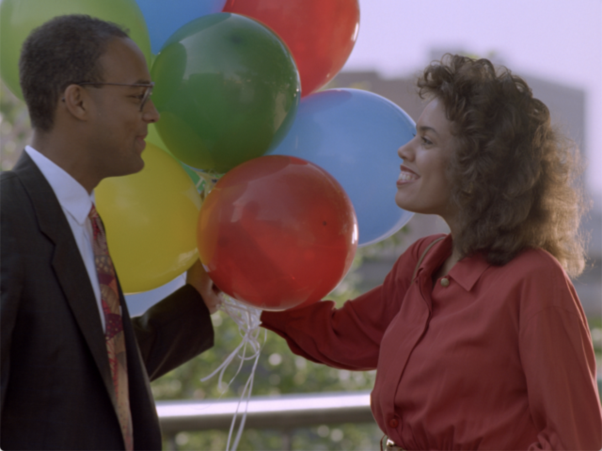
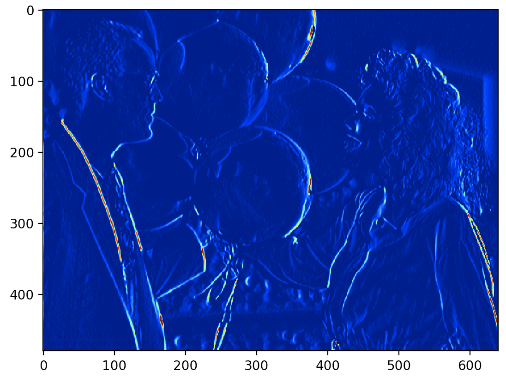
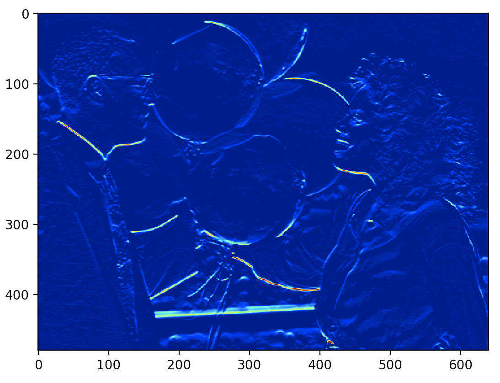
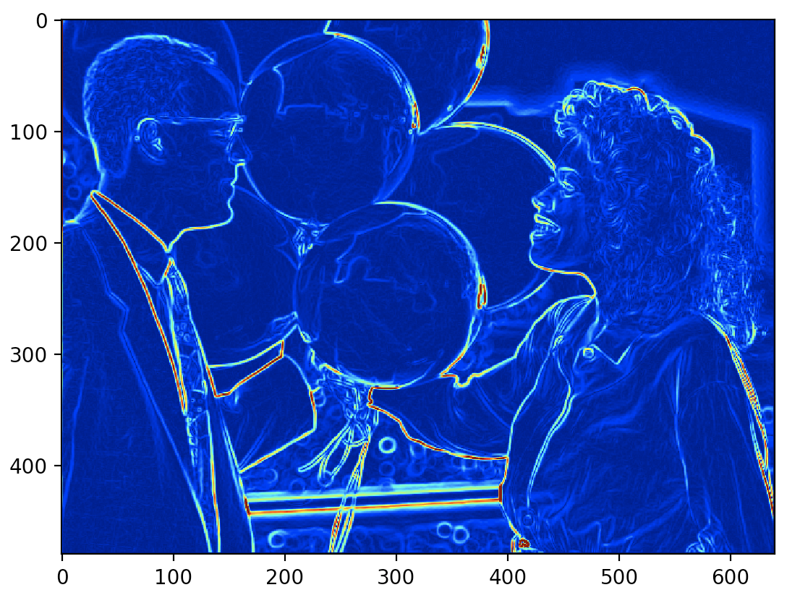
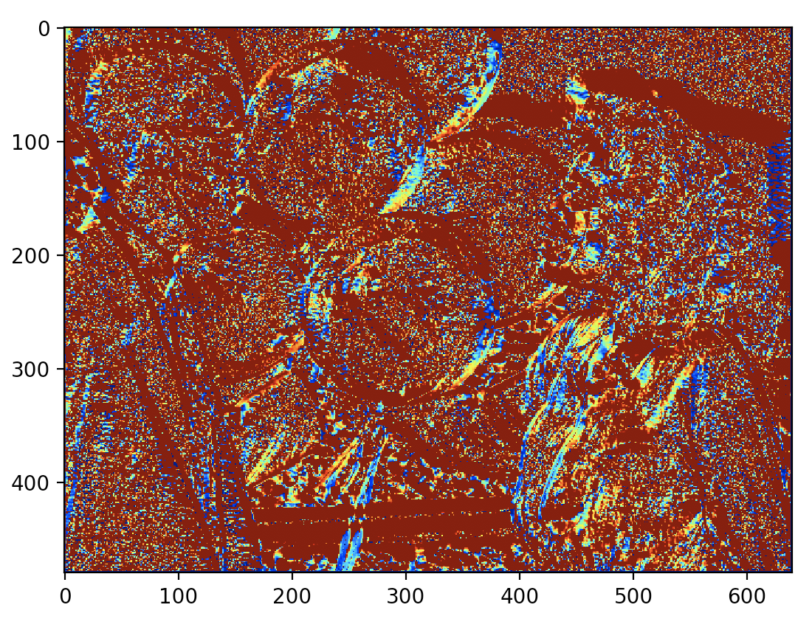
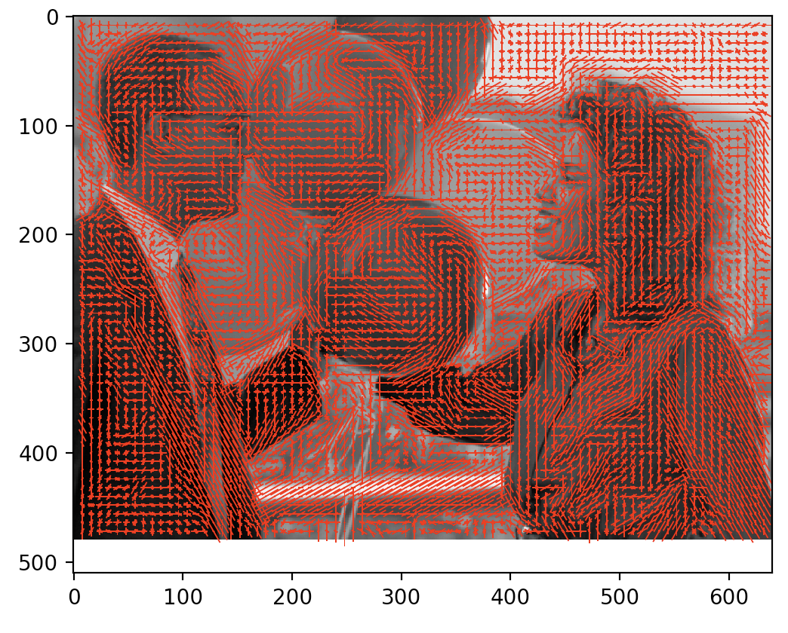
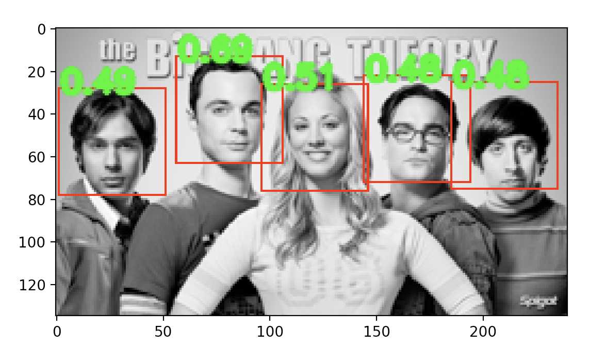

# HOG Descriptor and Face Detection

Dongha Kang


Histogram of Oriented Gradients (HOG) and Face Detection using Histogram of Oriented Gradients.

## Getting Started

To run the program.

```
python3 HOG_ver1.py
```

7 functions that helps to reach the HOG descriptor and also Face detection.
*get_differential_filter* and *filter_image* function help to filter the image by differentiation (both x and y).
With the filtered image, and *get_gradient* function, the image can be visualized by magnitude and angle of the gradient.
By gradient image and *build_histogram*, *get_block_descriptor* function, The image can be described as
Histogram. With the histogram, one can finally detect the face with target image and template image using *face_detection* function.
(It takes a while to run...)

## Running the tests

* extract_hog
* get_differential_filter
* filter_image
* get_gradient
* build_histogram
* get_block_descriptor
* face_detection

### Test Images


This is the original image.



im_dx, x direction filter



im_dy, y direction filter

After the filtering, the image will look like the above.



grad_mag gradient by magnitude


grad_angle gradient by angle

With the filter above, we can obtain magnitude and angle filtered image



HOG Descriptor. (angle)


Face Detection - Threshold


Face Detection after IoU.
